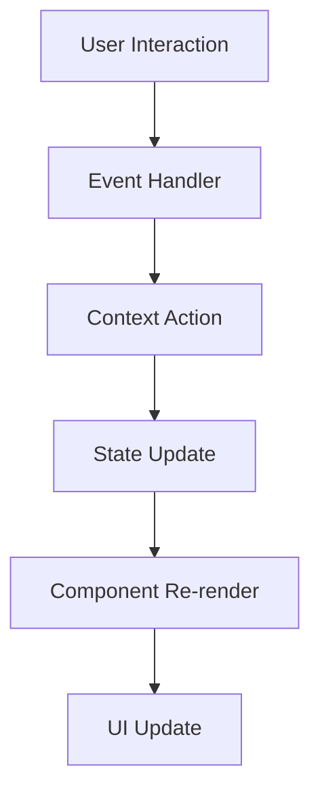
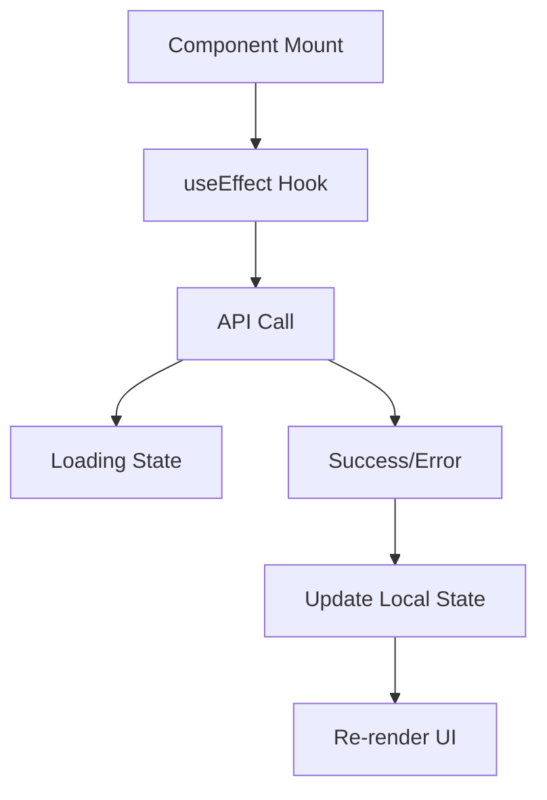
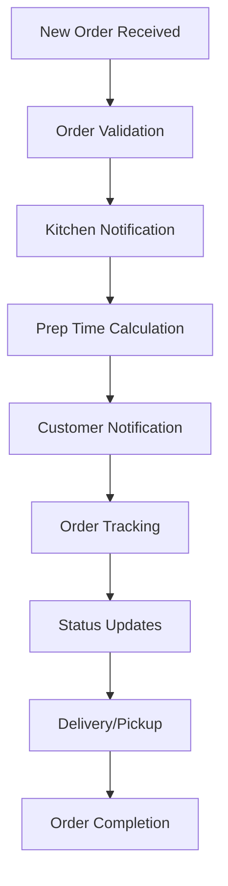
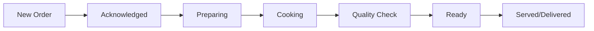

# Sonna Restaurant Development Guide 📋

> **Complete development guide for frontend, backend, admin dashboard, and kitchen operations**

## Table of Contents

1. [Design System & Style Guide](#design-system--style-guide)
2. [Frontend Architecture & Data Flow](#frontend-architecture--data-flow)
3. [Backend Integration Guide](#backend-integration-guide)
4. [Admin Dashboard Design & Workflow](#admin-dashboard-design--workflow)
5. [Kitchen Staff Interface & Workflow](#kitchen-staff-interface--workflow)
6. [Development Constraints & Standards](#development-constraints--standards)
7. [API Reference](#api-reference)
8. [Database Schema](#database-schema)

---

## Design System & Style Guide

### 🎨 Core Design Philosophy

**"Steve Jobs Minimalism"** - Every element serves a purpose. Remove the unnecessary, perfect the essential.

### Color Palette (HSL Values)

```css
/* Primary Colors */
--primary: 24 79% 54%        /* Warm Orange #D97706 */
--primary-foreground: 0 0% 98%   /* Near White */

/* Secondary Colors */
--secondary: 210 40% 98%     /* Light Gray */
--secondary-foreground: 222.2 84% 4.9%   /* Dark Gray */

/* Accent Colors */
--accent: 210 40% 96%        /* Lighter Gray */
--accent-foreground: 222.2 47.4% 11.2%   /* Medium Dark */

/* Status Colors */
--destructive: 0 84.2% 60.2%     /* Red for errors */
--success: 142 76% 36%           /* Green for success */
--warning: 38 92% 50%            /* Yellow for warnings */

/* Background Hierarchy */
--background: 0 0% 100%          /* Pure White */
--foreground: 222.2 84% 4.9%     /* Near Black */
--card: 0 0% 100%               /* Card Background */
--popover: 0 0% 100%            /* Overlay Background */

/* Interactive Elements */
--muted: 210 40% 96%            /* Disabled/Muted */
--muted-foreground: 215.4 16.3% 46.9%   /* Muted Text */
--border: 214.3 31.8% 91.4%     /* Border Color */
--input: 214.3 31.8% 91.4%      /* Input Border */
--ring: 222.2 84% 4.9%          /* Focus Ring */
```

### Typography Scale

```css
/* Font Families */
--font-sans: 'Inter', system-ui, sans-serif;
--font-mono: 'JetBrains Mono', monospace;

/* Font Sizes (Mobile-First) */
--text-xs: 0.75rem;     /* 12px */
--text-sm: 0.875rem;    /* 14px */
--text-base: 1rem;      /* 16px */
--text-lg: 1.125rem;    /* 18px */
--text-xl: 1.25rem;     /* 20px */
--text-2xl: 1.5rem;     /* 24px */
--text-3xl: 1.875rem;   /* 30px */
--text-4xl: 2.25rem;    /* 36px */

/* Line Heights */
--leading-tight: 1.25;
--leading-normal: 1.5;
--leading-relaxed: 1.625;
```

### Spacing System

```css
/* Consistent 4px grid system */
--spacing-0: 0;
--spacing-1: 0.25rem;   /* 4px */
--spacing-2: 0.5rem;    /* 8px */
--spacing-3: 0.75rem;   /* 12px */
--spacing-4: 1rem;      /* 16px */
--spacing-6: 1.5rem;    /* 24px */
--spacing-8: 2rem;      /* 32px */
--spacing-12: 3rem;     /* 48px */
--spacing-16: 4rem;     /* 64px */
--spacing-24: 6rem;     /* 96px */
```

### Component Design Patterns

#### Button Variants
- **Primary**: Main actions (Add to Cart, Order Now)
- **Secondary**: Secondary actions (View Details, Cancel)
- **Outline**: Subtle actions (Filters, Sort)
- **Ghost**: Minimal actions (Close, Back)
- **Destructive**: Delete/Remove actions

#### Card Structure
```tsx
<Card>
  <CardHeader>
    <CardTitle>Main heading</CardTitle>
    <CardDescription>Supporting text</CardDescription>
  </CardHeader>
  <CardContent>
    {/* Main content */}
  </CardContent>
  <CardFooter>
    {/* Actions */}
  </CardFooter>
</Card>
```

---

## Frontend Architecture & Data Flow

### 🏗️ Component Architecture

```
src/
├── components/
│   ├── ui/              # Shadcn base components
│   ├── mobile/          # Mobile-specific components
│   ├── layout/          # Layout components
│   └── feature/         # Feature-specific components
├── pages/               # Route components
├── contexts/            # Global state
├── hooks/               # Custom hooks
├── lib/                 # Utilities
└── data/                # Static data
```

### State Management Strategy

#### Global State (Context API)
- **CartContext**: Shopping cart state and operations
- **WishlistContext**: User favorites
- **AuthContext**: User authentication (to be implemented)
- **NotificationContext**: Toast notifications

#### Local State (useState/useReducer)
- Component-specific state
- Form state
- UI state (modals, dropdowns)

### Data Flow Patterns

#### 1. User Actions → State Updates


#### 2. API Integration Flow


### Mobile-First Responsive Strategy

```css
/* Mobile First (default) */
.container { width: 100%; padding: 1rem; }

/* Tablet (768px+) */
@media (min-width: 768px) {
  .container { max-width: 728px; padding: 2rem; }
}

/* Desktop (1024px+) */
@media (min-width: 1024px) {
  .container { max-width: 984px; padding: 3rem; }
}
```

---

## Backend Integration Guide

### 🔧 API Architecture

#### Base URL Structure
```
Production: https://api.sonna-restaurant.com/v1
Development: http://localhost:3001/v1
```

#### Authentication Strategy
- **JWT Tokens**: Access tokens (15 minutes) + Refresh tokens (7 days)
- **OAuth Integration**: Google, Facebook, Apple Sign-In
- **Guest Checkout**: Temporary session tokens

#### Core API Endpoints

##### Authentication
```
POST /auth/login
POST /auth/register
POST /auth/refresh
POST /auth/logout
POST /auth/forgot-password
POST /auth/reset-password
```

##### Menu Management
```
GET /menu/categories
GET /menu/items
GET /menu/items/:id
GET /menu/search?q={query}
GET /menu/recommendations
```

##### Order Management
```
POST /orders
GET /orders
GET /orders/:id
PUT /orders/:id/status
DELETE /orders/:id
```

##### User Management
```
GET /users/profile
PUT /users/profile
GET /users/orders
GET /users/favorites
POST /users/favorites/:itemId
DELETE /users/favorites/:itemId
```

### Database Schema Design

#### Core Tables

##### Users Table
```sql
CREATE TABLE users (
  id UUID PRIMARY KEY DEFAULT gen_random_uuid(),
  email VARCHAR(255) UNIQUE NOT NULL,
  phone VARCHAR(20),
  full_name VARCHAR(255),
  avatar_url TEXT,
  loyalty_points INTEGER DEFAULT 0,
  created_at TIMESTAMP DEFAULT NOW(),
  updated_at TIMESTAMP DEFAULT NOW()
);
```

##### Menu Items Table
```sql
CREATE TABLE menu_items (
  id UUID PRIMARY KEY DEFAULT gen_random_uuid(),
  name VARCHAR(255) NOT NULL,
  description TEXT,
  price DECIMAL(10,2) NOT NULL,
  category_id UUID REFERENCES categories(id),
  image_url TEXT,
  calories INTEGER,
  allergens TEXT[],
  is_vegan BOOLEAN DEFAULT FALSE,
  is_vegetarian BOOLEAN DEFAULT FALSE,
  is_gluten_free BOOLEAN DEFAULT FALSE,
  prep_time INTEGER, -- minutes
  is_available BOOLEAN DEFAULT TRUE,
  created_at TIMESTAMP DEFAULT NOW()
);
```

##### Orders Table
```sql
CREATE TABLE orders (
  id UUID PRIMARY KEY DEFAULT gen_random_uuid(),
  user_id UUID REFERENCES users(id),
  status VARCHAR(50) DEFAULT 'pending',
  total_amount DECIMAL(10,2) NOT NULL,
  delivery_address JSONB,
  estimated_delivery TIMESTAMP,
  actual_delivery TIMESTAMP,
  payment_method VARCHAR(50),
  payment_status VARCHAR(50) DEFAULT 'pending',
  special_instructions TEXT,
  created_at TIMESTAMP DEFAULT NOW()
);
```

##### Order Items Table
```sql
CREATE TABLE order_items (
  id UUID PRIMARY KEY DEFAULT gen_random_uuid(),
  order_id UUID REFERENCES orders(id),
  menu_item_id UUID REFERENCES menu_items(id),
  quantity INTEGER NOT NULL,
  unit_price DECIMAL(10,2) NOT NULL,
  customizations JSONB,
  created_at TIMESTAMP DEFAULT NOW()
);
```

### Real-time Features

#### WebSocket Events
```typescript
// Order status updates
socket.emit('order:status_changed', {
  orderId: string,
  status: 'preparing' | 'cooking' | 'ready' | 'delivered',
  estimatedTime: number
});

// Kitchen notifications
socket.emit('kitchen:new_order', {
  orderId: string,
  items: OrderItem[],
  priority: 'normal' | 'urgent'
});

// Admin notifications
socket.emit('admin:low_inventory', {
  itemId: string,
  currentStock: number,
  threshold: number
});
```

---

## Admin Dashboard Design & Workflow

### 🖥️ Dashboard Layout Structure

```
┌─────────────────────────────────────────────────────┐
│ Header: Logo | Navigation | User Menu | Notifications│
├─────────────────────────────────────────────────────┤
│ Sidebar: Menu | Orders | Analytics | Settings         │
├─────────┬───────────────────────────────────────────┤
│         │ Main Content Area                          │
│ Quick   │ ┌─────────────────────────────────────────┐ │
│ Actions │ │ Dashboard Cards / Data Views            │ │
│         │ │                                         │ │
│         │ │ Charts, Tables, Forms                   │ │
│         │ └─────────────────────────────────────────┘ │
└─────────┴───────────────────────────────────────────┘
```

### Core Admin Workflows

#### 1. Order Management Workflow


#### 2. Menu Management Interface

##### Menu Item Form
```tsx
interface MenuItemForm {
  name: string;
  description: string;
  price: number;
  category: string;
  image: File;
  allergens: string[];
  nutritionalInfo: {
    calories: number;
    protein: number;
    carbs: number;
    fat: number;
  };
  availability: {
    isAvailable: boolean;
    stockCount?: number;
    availableDays: string[];
    availableHours: { start: string; end: string; };
  };
  preparationTime: number;
}
```

#### 3. Analytics Dashboard

##### Key Performance Indicators (KPIs)
- **Revenue Metrics**: Daily/Weekly/Monthly revenue
- **Order Metrics**: Order count, average order value
- **Customer Metrics**: New vs returning customers, customer lifetime value
- **Operational Metrics**: Prep times, order fulfillment rate
- **Inventory Metrics**: Stock levels, waste tracking

##### Dashboard Cards Layout
```tsx
<div className="grid grid-cols-1 md:grid-cols-2 lg:grid-cols-4 gap-6">
  <KPICard title="Today's Revenue" value="$2,486" change="+12%" />
  <KPICard title="Orders Today" value="47" change="+8%" />
  <KPICard title="Avg Order Value" value="$32.50" change="+5%" />
  <KPICard title="Customer Satisfaction" value="4.8/5" change="+0.2" />
</div>
```

### User Roles & Permissions

#### Admin (Full Access)
- Complete system access
- User management
- Financial reports
- System configuration

#### Manager (Operations)
- Order management
- Menu updates
- Staff scheduling
- Inventory management

#### Kitchen Staff (Limited)
- Order viewing
- Status updates
- Inventory alerts
- Prep time tracking

#### Server/Cashier (Customer-facing)
- Order taking
- Customer management
- Payment processing
- Basic reporting

---

## Kitchen Staff Interface & Workflow

### 🍳 Kitchen Display System (KDS) Design

#### Order Display Layout
```
┌─────────────────────────────────────────────────────┐
│ Order #1247 | Table 12 | 14:32 | ⏱️ 8 min          │
├─────────────────────────────────────────────────────┤
│ 🍕 Margherita Pizza (L) - Extra cheese             │
│ 🍝 Carbonara Pasta - No bacon                      │
│ 🥗 Caesar Salad - Dressing on side                 │
├─────────────────────────────────────────────────────┤
│ Special Instructions: Customer allergic to nuts     │
├─────────────────────────────────────────────────────┤
│ [🏁 Start] [⏸️ Pause] [✅ Ready] [❌ Issue]        │
└─────────────────────────────────────────────────────┘
```

#### Order Status Workflow


#### Kitchen Interface Features

##### Real-time Order Queue
```tsx
interface KitchenOrder {
  id: string;
  orderNumber: string;
  customerName: string;
  tableNumber?: string;
  orderTime: Date;
  estimatedPrepTime: number;
  priority: 'normal' | 'urgent' | 'delayed';
  status: 'pending' | 'preparing' | 'cooking' | 'ready';
  items: Array<{
    name: string;
    quantity: number;
    customizations: string[];
    allergens: string[];
    specialInstructions?: string;
  }>;
}
```

##### Timer Management System
```tsx
interface TimerSystem {
  activeTimers: Map<string, {
    orderId: string;
    startTime: Date;
    estimatedTime: number;
    actualTime?: number;
    status: 'running' | 'paused' | 'completed';
  }>;
  
  startTimer: (orderId: string) => void;
  pauseTimer: (orderId: string) => void;
  completeTimer: (orderId: string) => void;
  getElapsedTime: (orderId: string) => number;
}
```

### Kitchen Workflow Optimization

#### Prep Station Organization
- **Cold Station**: Salads, sandwiches, cold appetizers
- **Hot Station**: Grilled items, sautéed dishes, hot appetizers
- **Pizza Station**: Pizza preparation and baking
- **Dessert Station**: Desserts and specialty items
- **Expediting Station**: Final plating and quality control

#### Communication Protocols
- **Order Calls**: Clear verbal confirmation of orders
- **Time Callouts**: Regular updates on estimated completion
- **Priority Alerts**: Visual and audio alerts for urgent orders
- **Quality Checks**: Mandatory inspection before marking ready

---

## Development Constraints & Standards

### 🔒 Code Quality Standards

#### TypeScript Configuration
```json
{
  "compilerOptions": {
    "strict": true,
    "noImplicitAny": true,
    "noImplicitReturns": true,
    "noUnusedLocals": true,
    "noUnusedParameters": true
  }
}
```

#### ESLint Rules (Key Rules)
```json
{
  "rules": {
    "@typescript-eslint/no-unused-vars": "error",
    "react-hooks/exhaustive-deps": "warn",
    "prefer-const": "error",
    "no-var": "error",
    "react/prop-types": "off"
  }
}
```

### Component Development Guidelines

#### Component Structure Template
```tsx
// ComponentName.tsx
import React from 'react';
import { cn } from '@/lib/utils';

interface ComponentNameProps {
  // Props definition
  className?: string;
  children?: React.ReactNode;
}

export const ComponentName: React.FC<ComponentNameProps> = ({
  className,
  children,
  ...props
}) => {
  return (
    <div className={cn("base-styles", className)} {...props}>
      {children}
    </div>
  );
};

ComponentName.displayName = "ComponentName";
```

#### Custom Hook Template
```tsx
// useCustomHook.ts
import { useState, useEffect } from 'react';

interface UseCustomHookProps {
  // Hook parameters
}

interface UseCustomHookReturn {
  // Return value types
}

export const useCustomHook = (props: UseCustomHookProps): UseCustomHookReturn => {
  // Hook implementation
  
  return {
    // Return values
  };
};
```

### Performance Standards

#### Bundle Size Targets
- **Initial Bundle**: < 250KB gzipped
- **Route Chunks**: < 100KB gzipped each
- **Component Libraries**: < 50KB gzipped

#### Core Web Vitals Targets
- **LCP (Largest Contentful Paint)**: < 2.5s
- **FID (First Input Delay)**: < 100ms
- **CLS (Cumulative Layout Shift)**: < 0.1

#### Code Splitting Strategy
```tsx
// Lazy load pages
const MenuPage = lazy(() => import('@/pages/Menu'));
const CartPage = lazy(() => import('@/pages/Cart'));

// Lazy load heavy components
const AdvancedChart = lazy(() => import('@/components/AdvancedChart'));

// Route-based splitting
<Route path="/menu" element={
  <Suspense fallback={<PageSkeleton />}>
    <MenuPage />
  </Suspense>
} />
```

### Testing Requirements

#### Unit Testing (Vitest)
```tsx
// Component.test.tsx
import { render, screen } from '@testing-library/react';
import { ComponentName } from './ComponentName';

describe('ComponentName', () => {
  test('renders correctly', () => {
    render(<ComponentName />);
    expect(screen.getByRole('button')).toBeInTheDocument();
  });
});
```

#### Integration Testing
- Test user workflows end-to-end
- Test API integration points
- Test error handling scenarios

#### Accessibility Testing
- Keyboard navigation testing
- Screen reader compatibility
- Color contrast validation
- Focus management testing

### Security Standards

#### Input Validation
```tsx
import { z } from 'zod';

const MenuItemSchema = z.object({
  name: z.string().min(1).max(100),
  price: z.number().positive(),
  description: z.string().max(500),
  allergens: z.array(z.string())
});
```

#### Sanitization
- HTML content sanitization
- XSS prevention
- SQL injection prevention
- CSRF protection

---

## API Reference

### 📡 REST API Endpoints

#### Menu Endpoints
```typescript
// GET /api/v1/menu/categories
interface MenuCategory {
  id: string;
  name: string;
  description: string;
  image_url: string;
  sort_order: number;
  is_active: boolean;
}

// GET /api/v1/menu/items?category_id={id}&limit={limit}&offset={offset}
interface MenuItem {
  id: string;
  name: string;
  description: string;
  price: number;
  category_id: string;
  image_url: string;
  allergens: string[];
  nutritional_info: {
    calories: number;
    protein: number;
    carbohydrates: number;
    fat: number;
  };
  is_available: boolean;
  preparation_time: number; // in minutes
}
```

#### Order Endpoints
```typescript
// POST /api/v1/orders
interface CreateOrderRequest {
  items: Array<{
    menu_item_id: string;
    quantity: number;
    customizations?: string[];
    special_instructions?: string;
  }>;
  delivery_address?: {
    street: string;
    city: string;
    postal_code: string;
    coordinates?: { lat: number; lng: number; };
  };
  payment_method: 'card' | 'cash' | 'digital_wallet';
  special_instructions?: string;
}

interface CreateOrderResponse {
  order_id: string;
  order_number: string;
  estimated_delivery_time: string;
  total_amount: number;
  payment_status: 'pending' | 'processing' | 'completed' | 'failed';
}
```

### WebSocket Events

#### Client to Server
```typescript
// Join order room for real-time updates
socket.emit('join_order', { order_id: string });

// Kitchen status updates
socket.emit('update_order_status', {
  order_id: string;
  status: 'preparing' | 'cooking' | 'ready' | 'delivered';
  estimated_completion?: string;
});
```

#### Server to Client
```typescript
// Order status changes
socket.on('order_status_updated', {
  order_id: string;
  status: string;
  estimated_completion?: string;
  message?: string;
});

// Delivery tracking
socket.on('delivery_update', {
  order_id: string;
  driver_location?: { lat: number; lng: number; };
  estimated_arrival: string;
});
```

---

## Database Schema

### 🗄️ Complete Schema Design

#### Core Tables

##### Categories Table
```sql
CREATE TABLE categories (
  id UUID PRIMARY KEY DEFAULT gen_random_uuid(),
  name VARCHAR(255) NOT NULL,
  description TEXT,
  image_url TEXT,
  emoji VARCHAR(10),
  sort_order INTEGER DEFAULT 0,
  is_active BOOLEAN DEFAULT TRUE,
  created_at TIMESTAMP DEFAULT NOW(),
  updated_at TIMESTAMP DEFAULT NOW()
);
```

##### Inventory Table
```sql
CREATE TABLE inventory (
  id UUID PRIMARY KEY DEFAULT gen_random_uuid(),
  menu_item_id UUID REFERENCES menu_items(id),
  current_stock INTEGER DEFAULT 0,
  minimum_threshold INTEGER DEFAULT 5,
  unit_cost DECIMAL(10,2),
  supplier_info JSONB,
  last_restocked TIMESTAMP,
  created_at TIMESTAMP DEFAULT NOW()
);
```

##### Promotions Table
```sql
CREATE TABLE promotions (
  id UUID PRIMARY KEY DEFAULT gen_random_uuid(),
  name VARCHAR(255) NOT NULL,
  description TEXT,
  discount_type VARCHAR(20), -- 'percentage' | 'fixed_amount'
  discount_value DECIMAL(10,2),
  min_order_amount DECIMAL(10,2),
  applicable_items UUID[], -- Array of menu_item_ids
  start_date TIMESTAMP,
  end_date TIMESTAMP,
  usage_limit INTEGER,
  current_usage INTEGER DEFAULT 0,
  is_active BOOLEAN DEFAULT TRUE,
  created_at TIMESTAMP DEFAULT NOW()
);
```

##### Reviews Table
```sql
CREATE TABLE reviews (
  id UUID PRIMARY KEY DEFAULT gen_random_uuid(),
  user_id UUID REFERENCES users(id),
  order_id UUID REFERENCES orders(id),
  menu_item_id UUID REFERENCES menu_items(id),
  rating INTEGER CHECK (rating >= 1 AND rating <= 5),
  comment TEXT,
  helpful_count INTEGER DEFAULT 0,
  is_verified BOOLEAN DEFAULT FALSE,
  created_at TIMESTAMP DEFAULT NOW()
);
```

#### Indexes for Performance
```sql
-- Menu item searches
CREATE INDEX idx_menu_items_category ON menu_items(category_id);
CREATE INDEX idx_menu_items_available ON menu_items(is_available);
CREATE INDEX idx_menu_items_name_search ON menu_items USING gin(to_tsvector('english', name || ' ' || description));

-- Order queries
CREATE INDEX idx_orders_user_date ON orders(user_id, created_at DESC);
CREATE INDEX idx_orders_status ON orders(status);

-- Performance optimization
CREATE INDEX idx_order_items_order_id ON order_items(order_id);
CREATE INDEX idx_reviews_menu_item ON reviews(menu_item_id);
```

---

## 🚀 Getting Started Checklist

### For Frontend Developers
- [ ] Clone repository and set up development environment
- [ ] Review design system tokens in `src/index.css`
- [ ] Understand component patterns in `src/components/ui/`
- [ ] Test mobile responsiveness on different devices
- [ ] Set up proper TypeScript configuration
- [ ] Run accessibility audits

### For Backend Developers
- [ ] Set up database schema using provided SQL scripts
- [ ] Implement JWT authentication system
- [ ] Create RESTful API endpoints
- [ ] Set up WebSocket for real-time features
- [ ] Implement proper error handling and logging
- [ ] Set up automated testing suite

### For Admin Dashboard Developers
- [ ] Design responsive admin layout
- [ ] Implement role-based access control
- [ ] Create real-time order management interface
- [ ] Build analytics and reporting features
- [ ] Implement inventory management system
- [ ] Set up notification system

### For Kitchen Interface Developers
- [ ] Design kitchen display system (KDS)
- [ ] Implement order queue management
- [ ] Create timer and tracking system
- [ ] Build status update interface
- [ ] Implement priority handling
- [ ] Test with kitchen staff for usability

---

## 📞 Support & Resources

### Documentation Links
- [React Documentation](https://react.dev/)
- [TypeScript Handbook](https://www.typescriptlang.org/docs/)
- [Tailwind CSS](https://tailwindcss.com/docs)
- [Shadcn/ui Components](https://ui.shadcn.com/)

### Development Tools
- **Design**: Figma, Adobe XD
- **API Testing**: Postman, Insomnia
- **Database**: PostgreSQL, Prisma ORM
- **Monitoring**: Sentry, LogRocket
- **Analytics**: Google Analytics, Mixpanel

### Contact Information
- **Technical Lead**: Me
- **Project Manager**: Me
- **Design Lead**: Also Me

---

*This guide is a living document. Please update it as the project evolves and new requirements emerge.*
